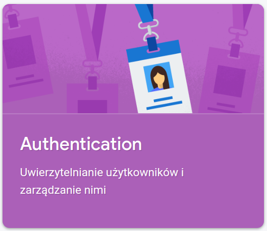
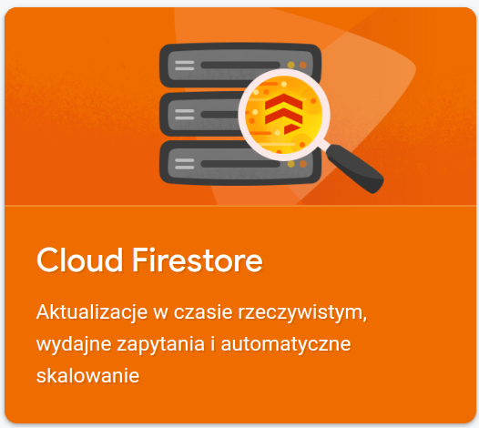
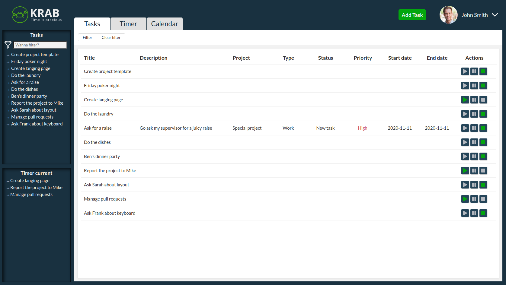

# KRAB - Time is precious 

### Table of Contents

- [About](#about)
- [Back-end](#back-end)
- [Deployment](#deployment)
- [Enviroment](#enviroment)
- [Features](#features)
- [How we did it](#how-we-did-it)
- [Out Team](#our-team)
- [Setup](#setup)
- [Supervision](#supervision)

### About

We believe that time is the most valuable asset. Our KRAB Team made effort to let you keep as much of it as possible. Time is precious.


This is an educational project. Our team created KRAB as a task during infoShare Academy Junior Front-End Developer course. \
The main goal was to implement first bigger project and test skills gained during course. We set a clear goal and defined precisely what we wanted to achieve:

- Create a complex React application
- Support it with Firebase
- Try out coding with ESLint, Prettier and Husky
- Work with SCRUM principles to perfect people-oriented team standards

### Back-end

<div display="flex">


</div>
Well, KRAB is a pieace of art created by a bunch of Junior Front-End Devs, so you probably think we had some Back-End help round the corner... \
Couldn't be more wrong! Keeping our horizon broad enough our Team decided to implement some back-end features using Firebase. \
We kicked of with Firebase Firesotre to provide a flexible, scalable NoSQL cloud database to store and sync data. \
For safety reasons and to keep track of KRAB's users and contributers, authentication system was applied with Firebase Authentication.

### Deployment



Should you require testing on your own, KRAB has been deployed via Github Pages. You can easily create an account and start the journey, just click here: <a href="https://infoshareacademy.github.io/jfddr1-fusyzkawy-app/" target="_blank">Link to page</a>

### Enviroment

KRAB application was written in <a href="https://en.reactjs.org/" target="_blank">React</a>. The enviroment was set up using create-react-app. \
Moreover to style our app in a modern way our Team decided to focus on using <a href="https://styled-components.com/" target="_blank">styled-components</a>. \
What is more KRAB application was based on modern web app standards. Hence implementing various features using <a href="https://en.reactjs.org/docs/hooks-intro.html" target="_blank">React Hooks</a>. \
In order to manage app state, hook useState was provided. \
When it came to performing data fetching, subscriptions and manually changing the DOM from React components, our Team chose to implement it with another hook, useEffect. \
Lastly, all crucial info to maintain the KRAB was safely stored and managed thanks to useContext hook.

### Features

A selection of things you can do with KRAB:

1.
2.
3.
4.
5.
6.
7.

### Feedback

Feel free to send us feedback via mail or file an issue. Feature requests are always welcome. If you wish to contribute, please let us know.

### How we did it?

We started with brainstorming through every idea. Thanks to Figma and Miro, a UI/UX model has occured. \
After creating a complex scheme of every view, our Team figured out which element should fire after which user's action. \
And then the fun BEGAN!

### Our Team

Project name is an abbreviation of our names: \
K for Kuba => Check <a href="https://github.com/james-hope">Kuba's Github Account</a> here. \
R for Radek => Check <a href="https://github.com/pachulski">Radek's Github Account</a> here. \
A for Ania => Check <a href="https://github.com/ania1995">Ania's Github Account</a> here. \
B for Bartek => Check <a href="https://github.com/BartekDerylo">Bartek's Github Account</a> here.

### Setup

KRAB is open to advice from devs around globe. You can try it yourself.
Fork `master` branch into your personal repository. Clone it to local computer. Install node modules. Before starting please ensure if there no errors.

```
$ git clone https://github.com/infoshareacademy/jfddr1-fusyzkawy-app.git
$ cd [project_name]
$ npm install
$ npm run test
$ npm start
```

### Supervsion

This project was supervised by the <a href="https://github.com/infoshareacademy">infoShare Academy</a>. Our trainers took great effort to share their knowledge giving KRAB the opportunity to grow. We'd like to express special thanks to <a href="https://github.com/cytrowski">@cytrowski</a> and <a href="https://github.com/mitroc">@mitroc</a> for every kind and brutal word.
