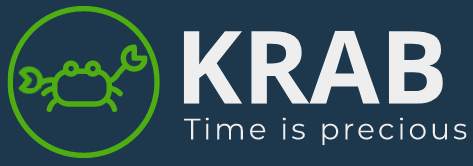

# KRAB - Time is precious    

### About
This is an educational project. Our team created KRAB as a task on infoShare Academy course.  
### How we did it?
We started with brainstorming through every idea. Thanks to Figma and Miro, a UX model has occured.  \
After creating a complex scheme of every view, our team figured out which element should fire after which user's action.  \
And then the fun BEGAN!
### Our Team
Project name is an abbreviation of our names:  \
K for Kuba => Check <a href="https://github.com/james-hope">Kuba's Github Account</a> here.  \
R for Radek => Check <a href="https://github.com/pachulski">Radek's Github Account</a> here.  \
A for Ania => Check <a href="https://github.com/ania1995">Ania's Github Account</a> here.  \
B for Bartek => Check <a href="https://github.com/BartekDerylo">Bartek's Github Account</a> here.  

